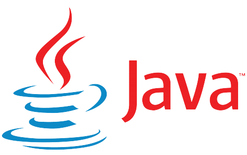

# Hi there, I'm Stevanus Andika Galih Setiawan - aka [Steven](https://stevanusandika.github.io/Portfolio-Stevanus/) 👋
## About me:
- 🔭 I'm fresh graduated
- 🌱 I’m currently learning Javascript and       Php
- 👯 I’m looking to collaborate as Web developer
- 🤔 I’m looking for create reponsive web design
- 💬 Ask me about anything
- 📫 How to reach me: stevcomp58@gmail.com

## Education:

#### 1. [SMK Bina Nusa Mandiri](https://smkbinanusamandiri.sch.id/)|Jakarta|`2020-2023`
   - Edit videos with Adobe Premiere.
   - Make photo editing with Photoshop.
   - Create publication design.
   - Create animated films/ads with Adobe     Flash.
 #### 2. [SMPN  230 Jakarta](https://www.smpn230jkt.sch.id/) | Jakarta | `2017-2020`
   

## Work Experience:
#### 1. [Surya Komputer](https://maps.app.goo.gl/zyroHXGj7NhD4AYAA)| Student Intern | Jakarta |`01 November 2021- 24 February 2022`
   - Assemble and clean pc components.
   - Create a network cable.
   - Windows installation and applications.
   - Backup data
---

### Languages and Tools:

[][webdev]
[][webdev]
[][webdev]
[][webdev]
[][webdev]
[][webdev]

 
 

---
### Connect with me:

&nbsp;&nbsp;

[webdev]: https://github.com//StevanuAndika/StevanusAndika
