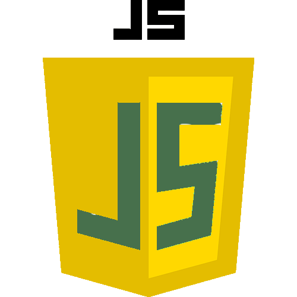
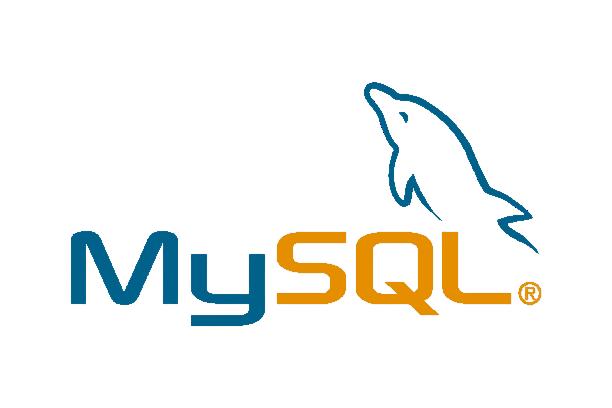

# Hi there, I'm Stevanus Andika Galih Setiawan - aka [Steven](https://stevanusandika.github.io/Portfolio-Stevanus/) 👋
## About me:
- 🔭 I'm fresh graduated
- 🌱 I’m currently learning Javascript and php
- 👯 I’m looking to collaborate as web developer
- 🤔I’m looking for create reponsive web design and game development
- 💬 Ask me about anything
- 📫 How to reach me: stevcomp58@gmail.com

## Education:

#### 1. [SMK Bina Nusa Mandiri](https://smkbinanusamandiri.sch.id/)|Jakarta|`2020-2023`
   - Edit videos with Adobe Premiere.
   - Make photo editing with Photoshop.
   - Create publication design.
   - Create animated films/ads with Adobe Flash.
 #### 2. [Universitas Ipwija | Software Engineering ](https://ipwija.ac.id/) | bogor| `2023-2027`
   - Create software, both web-based, application and desktop.
   - Managing software development.
   - Test, debug and deploy the software that has been created
   - Create animated films/ads with Adobe Flash.
   - Applying one of the SDLC (Software Development Life Cycle) principles.
   - System analysis and user needs in software development.
   - Implement structural and object-oriented programming.
   - Create, manage databases both SQL and non SQL based.
   - Maintaining security in the software being developed.
## Work Experience:
#### 1. [Surya Komputer](https://maps.app.goo.gl/zyroHXGj7NhD4AYAA)| Student Intern | Jakarta |`01 November 2021- 24 February 2022`
   - Assemble and clean pc components.
   - Create a network cable.
   - Windows installation and applications.
   - Backup data

   #### 2. [PT.Elwilis Mitra Sejahtera](https://www.elwilis.com/)| Staff IT Support | Jakarta |`06 June 2023- 31 Agustus  2023`
   - Performing backups and repairs for the company's internal computers.
   - Responsible for IT equipment assets within the company.
   - Providing support to customers for applications sold by the company.
   - Conducting presentations and providing tutorials on how to use the applications sold by the company.
   - Creating reports/proposals required by the company and being able to present them accurately and in accordance with the expected procedures/structure.
     
   #### 2. [Freelance Programmer](https://github.com/StevanusAndikaGS)| Programmer & Software Tester | Jakarta |`01 October 2023- now` 
   - assist students in completing coding assignments 
   - create programs both in terms of appearance and logic
   - ensure that the program can run properly, without any errors/bug
   

---

### Languages and Tools:

[][webdev]
[][webdev]
[][webdev]
[][webdev]
[][webdev]
[][webdev]

 
 

---
### Connect with me:

&nbsp;&nbsp;

[webdev]: https://github.com/StevanusAndika
